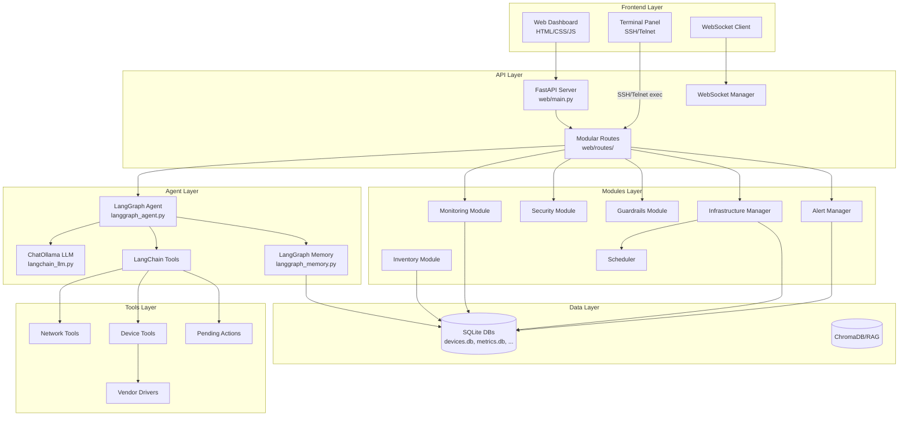
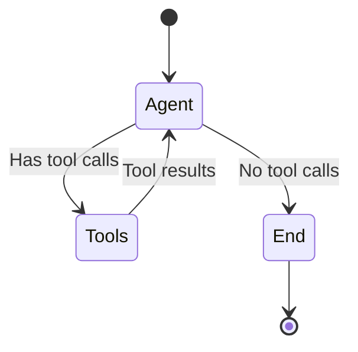
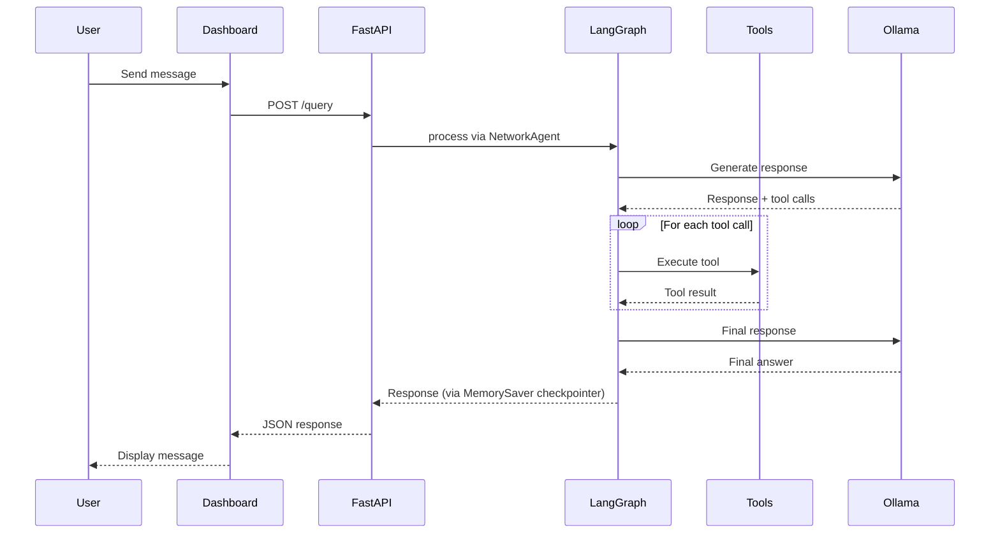
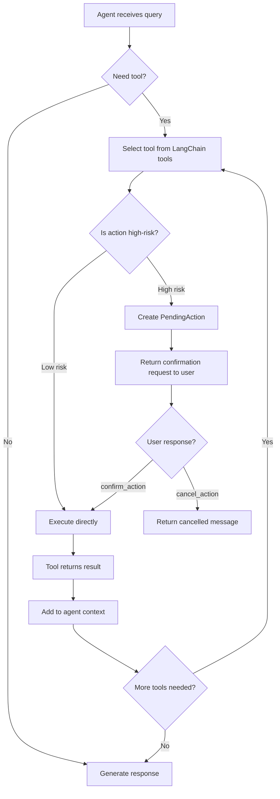
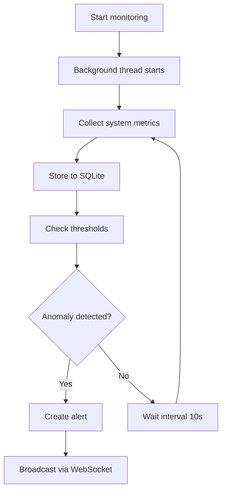
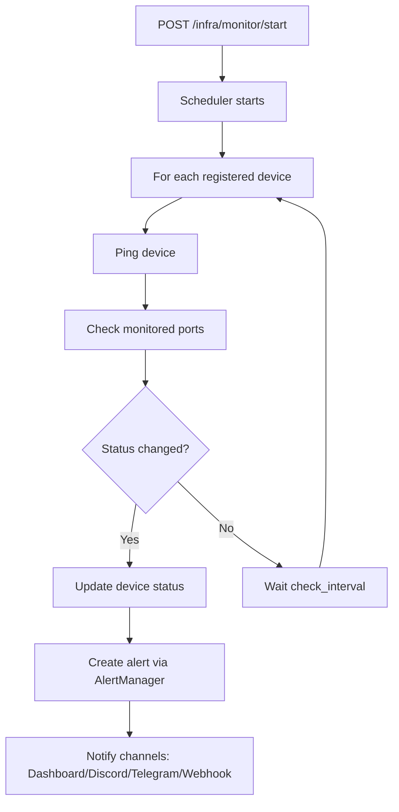
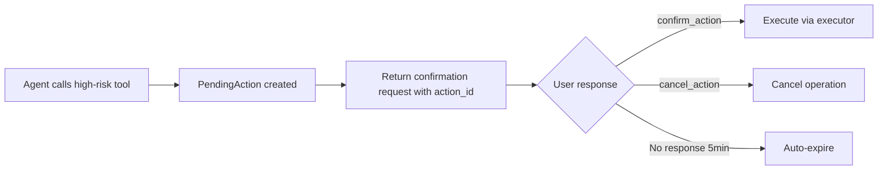
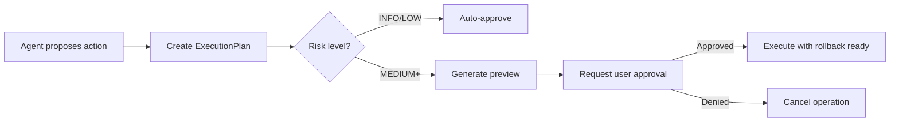
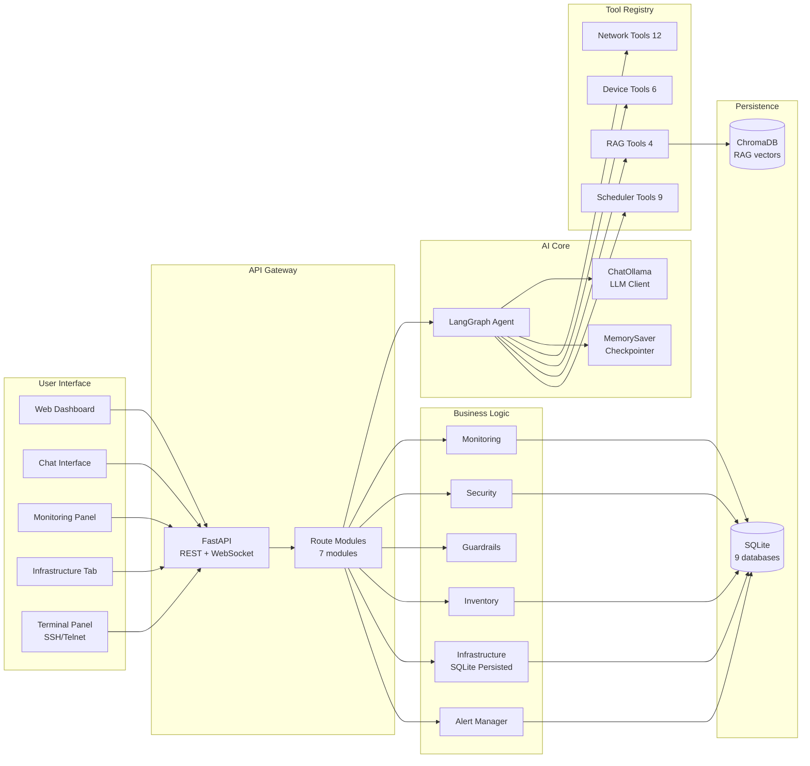
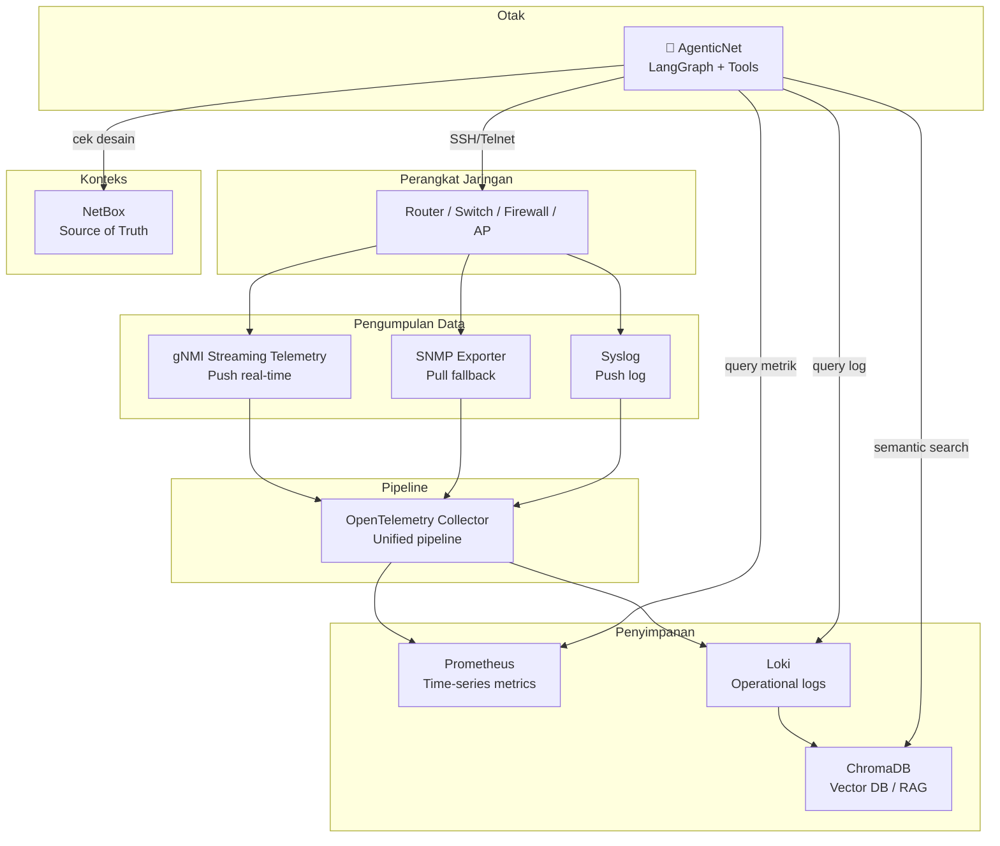

# AgenticNet - Dokumentasi Sistem Lengkap

## Ringkasan Eksekutif

**AgenticNet** adalah sistem AI otonom untuk operasi infrastruktur jaringan yang menggunakan **LangGraph** dengan **Ollama** (LLaMA 3.x). Sistem ini dirancang untuk mengelola, memonitor, dan mengotomasi tugas-tugas jaringan secara cerdas dengan tetap menjaga keamanan dan transparansi.

---

## Arsitektur Sistem



---

## Struktur Direktori

```
agenticNet/
├── main.py                        # Entry point aplikasi
├── config.py                      # Konfigurasi global
├── requirements.txt               # Dependencies
├── .env.example                   # Template environment variables
│
├── agent/                         # Core AI Agent
│   ├── langgraph_agent.py         # LangGraph agent utama (NetworkAgent)
│   ├── langchain_llm.py           # ChatOllama LLM wrapper
│   ├── langgraph_memory.py        # LangGraph memory checkpointer
│   ├── langchain_tools.py         # LangChain tool wrappers utama
│   ├── langchain_device_tools.py  # Device management tools
│   ├── langchain_backup_tools.py  # Config backup tools
│   ├── langchain_memory_tools.py  # Memory management tools
│   ├── langchain_rag_tools.py     # RAG knowledge tools
│   ├── langchain_report_tools.py  # Report generation tools
│   ├── langchain_scheduler_tools.py # Scheduler & alert tools
│   ├── langchain_topology_tools.py  # Network topology tools
│   ├── infrastructure.py          # Infrastructure device manager
│   ├── alerting.py                # Alert manager & notifications
│   ├── scheduler.py               # Scheduled task execution
│   ├── long_term_memory.py        # Long-term memory + solutions
│   ├── network_topology.py        # Network topology mapping
│   ├── rag_knowledge.py           # RAG knowledge base
│   ├── report_generator.py        # Laporan otomatis
│   ├── config_backup.py           # Config backup manager
│   └── logging_config.py          # Structured logging
│
├── modules/                       # Modul Fungsional
│   ├── monitoring.py              # System & network monitoring
│   ├── inventory.py               # Device inventory management
│   ├── security.py                # Security & compliance
│   └── guardrails.py              # Risk assessment & approval
│
├── tools/                         # Network Tools
│   ├── network_tools.py           # Diagnostic tools (ping, traceroute, etc)
│   ├── pending_actions.py         # High-risk action confirmation store
│   ├── vendor_drivers.py          # Multi-vendor device drivers
│   └── unified_commands.py        # Cross-vendor command abstraction
│
├── web/                           # Web Interface
│   ├── main.py                    # FastAPI application (modular)
│   ├── websocket_manager.py       # WebSocket connection manager
│   ├── routes/                    # Modular route handlers
│   │   ├── health.py              # Health, metrics, network endpoints
│   │   ├── chat.py                # Chat, streaming, conversation endpoints
│   │   ├── models.py              # LLM model management
│   │   ├── workflows.py           # Tool execution & workflows
│   │   ├── infrastructure.py      # Infrastructure & alert management
│   │   ├── devices.py             # Device commands & inventory
│   │   └── guardrails.py          # Human-in-the-loop approval
│   ├── templates/                 # Jinja2 templates
│   └── static/                    # CSS, JS, assets
│       ├── css/
│       └── js/
│
└── data/                          # Persistent Data
    ├── conversations.db           # LangGraph conversation checkpoints
    ├── chat_history.db            # Chat history (SQLite)
    ├── workflow_memory.db         # Workflow memory
    ├── long_term_memory.db        # Solutions & patterns
    ├── devices.db                 # Device registry (persisted)
    ├── inventory.db               # Device inventory
    ├── metrics.db                 # System metrics history
    ├── config_backups.db          # Configuration backups
    ├── reports/                   # Generated reports
    └── chroma_db/                 # Vector embeddings (RAG)
```

---

## Komponen Utama

### 1. Entry Point & Konfigurasi

#### main.py
Entry point aplikasi yang menjalankan server Uvicorn:
```python
uvicorn.run("web.main:app", host=config.HOST, port=config.PORT, reload=config.DEBUG)
```

#### config.py
Konfigurasi global termasuk:
- **Ollama Settings**: Host, model, available models
- **Server Settings**: Host, port, debug mode
- **Agent Settings**: Max reasoning steps, risk threshold

```python
class Config:
    OLLAMA_HOST = "http://localhost:11434"
    OLLAMA_MODEL = os.getenv("OLLAMA_MODEL", "DEFAULT_MODEL")
    AVAILABLE_MODELS = {
        "gpt-oss:20b": {...},
        "glm-4.7-flash:latest": {...}
    }
    DEFAULT_MODEL = "gpt-oss:20b"
    MAX_REASONING_STEPS = 10
    RISK_THRESHOLD = 0.7  # Block actions above this risk level
```

---

### 2. LangGraph Agent

#### langgraph_agent.py

Implementasi agent berbasis LangGraph dengan:

**State Management:**
```python
class AgentState:
    messages: Annotated[List[BaseMessage], add_messages]
```

**Graph Builder:**
```python
def build_agent_graph(checkpointer=None):
    graph_builder = StateGraph(AgentState)
    graph_builder.add_node("agent", agent_node)
    graph_builder.add_node("tools", tool_node)
    graph_builder.add_conditional_edges("agent", should_continue)
```

**NetworkAgent Class:**
- `invoke(query, thread_id)` - Proses query synchronous
- `ainvoke(query, thread_id)` - Proses query async
- `astream(query, thread_id)` - Stream response chunks
- `get_history(thread_id)` - Ambil conversation history
- `clear_history(thread_id)` - Hapus history



#### langchain_llm.py

Wrapper ChatOllama untuk LangGraph:

```python
def get_llm(model=None, base_url=None, temperature=0.7, timeout=45):
    """Get LangChain ChatOllama instance"""
    return ChatOllama(model=model or config.OLLAMA_MODEL, ...)

def get_llm_with_tools(tools: list, **kwargs):
    """Get LLM with tools bound for function calling"""
    llm = get_llm(**kwargs)
    return llm.bind_tools(tools)
```

---

### 3. Memory System

AgenticNet menggunakan **LangGraph MemorySaver** sebagai checkpointer utama untuk conversation state, serta **Long-Term Memory** terpisah.

#### 3.1 LangGraph Memory (langgraph_memory.py)

Mengelola conversation persistence menggunakan LangGraph checkpointer:

```python
class ConversationManager:
    def get_thread_config(thread_id: str) -> dict
    def list_threads() -> list
    def clear_thread(thread_id: str) -> bool
```

**Database**: `data/conversations.db`
- Thread-based conversation isolation
- MemorySaver checkpointer compatible with async/sync operations

#### 3.2 Long-Term Memory (long_term_memory.py)

Menyimpan solusi troubleshooting dan preferensi:

```python
class LongTermMemory:
    def save_solution(problem, solution, category, metadata)
    def find_similar_solutions(query, category, limit)
    def get_top_solutions(category, limit)
    def set_preference(key, value)
    def get_preference(key, default)
    def record_pattern(pattern_type, pattern_data)
```

**Database**: `data/long_term_memory.db`
- Tabel `solutions`: Cached troubleshooting solutions
- Tabel `preferences`: User preferences
- Tabel `patterns`: Learned patterns

---

### 4. Tool System

#### 4.1 LangChain Tools (langchain_tools.py)

File utama yang menggabungkan semua tools untuk LangGraph agent:

```python
def get_all_tools():
    """Get all tools for LangGraph agent including:
    - Network diagnostic tools (12)
    - Device management tools (6)
    - RAG/Knowledge base tools (4)
    - Scheduler/Alert tools (9)
    """
```

**Kategori Tools:**

| Kategori | Tools | File |
|----------|-------|------|
| **Connectivity** | `ping`, `traceroute`, `check_port`, `port_scan` | `langchain_tools.py` |
| **DNS** | `dns_lookup`, `nslookup` | `langchain_tools.py` |
| **Info** | `get_network_info`, `get_provider_info`, `get_interfaces` | `langchain_tools.py` |
| **Monitoring** | `get_connections`, `measure_latency`, `get_bandwidth_stats` | `langchain_tools.py` |
| **High-Risk** | `disable_local_interface`, `enable_local_interface`, `shutdown_remote_interface`, `enable_remote_interface` | `langchain_tools.py` |
| **Confirmation** | `confirm_action`, `cancel_action` | `langchain_tools.py` |
| **Device** | `get_device_info`, `get_cpu_memory`, `get_routing_table` | `langchain_device_tools.py` |
| **RAG** | `search_knowledge`, `add_knowledge` | `langchain_rag_tools.py` |
| **Scheduler** | `create_schedule`, `list_schedules`, `cancel_schedule` | `langchain_scheduler_tools.py` |
| **Backup** | `backup_config`, `restore_config`, `list_backups` | `langchain_backup_tools.py` |
| **Topology** | `get_topology`, `discover_neighbors` | `langchain_topology_tools.py` |
| **Reports** | `generate_report`, `list_reports` | `langchain_report_tools.py` |

#### 4.2 Network Tools (network_tools.py)

**Diagnostic Tools:**
| Tool | Fungsi |
|------|--------|
| `ping(host, count)` | Cek konektivitas |
| `traceroute(host)` | Trace network path |
| `dns_lookup(hostname)` | DNS resolution |
| `port_scan(host, ports)` | Scan port terbuka |
| `get_network_info()` | Info jaringan lokal |
| `get_provider_info()` | Info ISP/provider |
| `get_interfaces()` | List network interfaces |
| `get_connections()` | Active connections |
| `measure_latency(hosts)` | Latency measurement |
| `get_bandwidth_stats()` | Bandwidth usage |

#### 4.3 Pending Actions (pending_actions.py)

Sistem konfirmasi untuk aksi berisiko tinggi:

```python
class PendingActionsStore:
    def add(tool_name, params, description, risk_reason) -> PendingAction
    def get(action_id) -> PendingAction
    def confirm(action_id) -> Dict
    def cancel(action_id) -> Dict
    def list_pending() -> list
```

- Actions auto-expire setelah 5 menit
- Mendukung high-risk interface management (enable/disable)

#### 4.4 Vendor Drivers (vendor_drivers.py)

Multi-vendor device support:
- Cisco IOS/NXOS
- Mikrotik RouterOS
- Ubiquiti EdgeRouter
- Linux Servers

```python
class UnifiedCommand:
    def get_interfaces(device_ip)
    def get_cpu_memory(device_ip)
    def get_routing_table(device_ip)
    def shutdown_interface(device_ip, interface)  # ⚠️ Requires approval
    def enable_interface(device_ip, interface)    # ⚠️ Requires approval
```

---

### 5. Infrastructure & Alert System

#### 5.1 Infrastructure Manager (agent/infrastructure.py)

Manajemen perangkat jaringan dengan **SQLite persistence** (`data/devices.db`):

```python
class InfrastructureManager:
    # CRUD
    def add_device(name, ip, device_type, ...) -> NetworkDevice
    def remove_device(device_id) -> bool
    def get_device(device_id) -> NetworkDevice
    def list_devices(device_type, status) -> List
    def update_device(device_id, **kwargs) -> NetworkDevice
    def get_status_summary() -> Dict
    def export_config() -> str
    def import_config(config_json) -> int
    
    # SQLite Persistence
    def _init_db()              # Create devices & meta tables
    def _save_device_to_db(device)   # INSERT OR REPLACE single device
    def _delete_device_from_db(id)   # DELETE single device
    def _load_from_db()              # Load all devices on startup
```

**Device Types:** `router`, `switch`, `server`, `pc`, `printer`, `access_point`, `firewall`, `other`

**Device Status:** `online`, `offline`, `degraded`, `unknown`

**Connection Protocol:** `ssh`, `telnet`, `none`

**Persistence Schema (`data/devices.db`):**
```sql
CREATE TABLE devices (
    id TEXT PRIMARY KEY,
    name TEXT NOT NULL,
    ip TEXT NOT NULL,
    type TEXT,
    description TEXT, location TEXT,
    ports_to_monitor TEXT,        -- JSON array
    check_interval_seconds INTEGER,
    enabled INTEGER,
    created_at TEXT,
    connection_protocol TEXT,     -- ssh/telnet/none
    ssh_port INTEGER,
    ssh_username TEXT,
    ssh_password TEXT
);

CREATE TABLE meta (
    key TEXT PRIMARY KEY,
    value TEXT
);
```

#### 5.2 Terminal Panel (SSH/Telnet)

Dashboard menyediakan terminal interaktif untuk eksekusi perintah remote:

- **SSH** — via `paramiko` library
- **Telnet** — via Python `socket` library
- **Unified endpoint** — otomatis routing ke SSH atau Telnet berdasarkan `connection_protocol` device

**Endpoints:**
| Endpoint | Fungsi |
|----------|--------|
| `POST /infra/devices/{id}/ssh/exec` | Eksekusi command via SSH |
| `POST /infra/devices/{id}/telnet/exec` | Eksekusi command via Telnet |
| `POST /infra/devices/{id}/remote/exec` | Unified — otomatis pilih SSH/Telnet |

#### 5.3 Alert Manager (agent/alerting.py)

Sistem notifikasi multi-channel:

```python
class AlertManager:
    def create_alert(device_id, device_name, device_ip, severity, message) -> Alert
    def acknowledge(alert_id, by) -> bool
    def resolve(alert_id) -> bool
    def get_alerts(severity, device_id, unresolved_only, limit) -> List
    def get_summary() -> Dict
```

**Alert Channels:**
- Dashboard (WebSocket broadcast)
- Webhook (custom URL)
- Discord (webhook integration)
- Telegram (bot API)
- Email (SMTP)

**Alert Severity:** `info`, `warning`, `critical`

#### 5.4 Scheduler (agent/scheduler.py)

Penjadwalan health check otomatis untuk perangkat terdaftar.

---

### 6. Modules

#### 6.1 Monitoring Module (monitoring.py)

Real-time system monitoring dengan psutil:

```python
class MonitoringModule:
    def collect_system_metrics() -> SystemMetrics
    def start_collection(interval=10)  # Background collection
    def stop_collection()
    def analyze_trend(metric_name, window_size)
    def detect_anomaly(metric: MetricPoint)
    def get_health_summary()
    def update_network_metrics(latency, bandwidth)
    def get_interface_details(interface_name)
    def get_interface_history(interface_name, hours)
    def get_metric_history(metric_name, hours)
```

**Metrics Collected:**
- CPU: percent, per-core, count
- Memory: total, used, available, percent
- Disk: usage, read/write speeds
- Network: bytes sent/recv, packets, errors
- Interfaces: per-interface statistics

**Database**: `data/metrics.db`
- Historical metrics storage
- Interface-specific history

#### 6.2 Inventory Module (inventory.py)

Device inventory management:

```python
class InventoryModule:
    def get_device(ip_or_hostname) -> DeviceInfo
    def list_devices(vendor, role, enabled_only)
    def add_device(device: DeviceInfo)
    def update_device(device: DeviceInfo)
    def delete_device(ip_or_id)
    def get_credentials(credential_id) -> DeviceCredentials
    def get_connection_params(device) -> Dict  # For netmiko
```

**Vendor Types:**
- `cisco_ios`, `cisco_nxos`
- `mikrotik_routeros`
- `ubiquiti_edgerouter`
- `linux`

**Device Roles:**
- `router`, `switch`, `firewall`
- `access_point`, `server`, `other`

**Database**: `data/inventory.db`
- Supports NetBox API integration (optional)
- SQLite fallback for local development

#### 6.3 Security Module (security.py)

Security & compliance checking:

```python
class SecurityModule:
    def analyze_config(config_text, device_type)
    def check_compliance(standard: ComplianceStandard)
    def get_risk_summary()
```

**Compliance Standards:**
- ISO 27001
- NIST Framework
- CIS Benchmarks

**Security Checks:**
- Open risky ports
- Weak protocols
- Default credentials
- Unencrypted traffic
- Missing firewall rules

#### 6.4 Guardrails Module (guardrails.py)

Human-in-the-Loop approval workflow:

```python
class GuardrailsModule:
    def assess_risk(actions: List[Dict]) -> RiskLevel
    def create_execution_plan(goal, actions) -> ExecutionPlan
    def requires_approval(plan: ExecutionPlan) -> bool
    def request_approval(plan: ExecutionPlan) -> Tuple[bool, str]
    def validate_command(command) -> Tuple[bool, str, RiskLevel]
```

**Risk Levels:**
- `INFO`: Read-only commands
- `LOW`: Minor changes
- `MEDIUM`: Configuration changes
- `HIGH`: Service-affecting changes
- `CRITICAL`: Destructive operations

**Command Classifier:**
```python
class CommandClassifier:
    RISK_PATTERNS = {
        RiskLevel.CRITICAL: [r"(reload|reboot|reset|factory)", r"(delete|erase|format)"],
        RiskLevel.HIGH: [r"(shutdown|disable)", r"(configure|set)"],
        RiskLevel.MEDIUM: [r"(add|remove|modify)"],
    }
    BLOCKED_COMMANDS = ["format flash", "erase nvram"]
```

---

### 7. Web Layer

#### 7.1 FastAPI Application (web/main.py)

Aplikasi modular dengan route terpisah:

```python
app = FastAPI(
    title="Agentic Network Infrastructure Operator",
    version="2.0.0",
    lifespan=lifespan
)

# Route modules
app.include_router(health_routes.router)
app.include_router(chat_routes.router)
app.include_router(model_routes.router)
app.include_router(workflow_routes.router)
app.include_router(infra_routes.router)
app.include_router(device_routes.router)
app.include_router(guardrails_routes.router)
```

**Endpoints Overview:**

| Category | Endpoint | Method | Description |
|----------|----------|--------|-------------|
| **Core** | `/` | GET | Dashboard |
| **Health** | `/health` | GET | Health check (cached) |
| | `/monitoring/status` | GET | Monitoring status |
| | `/monitoring/metrics` | GET | System metrics |
| | `/monitoring/metrics/detailed` | GET | Detailed metrics |
| | `/monitoring/trends/{metric}` | GET | Metric trend analysis |
| | `/monitoring/interfaces/{name}` | GET | Interface details |
| | `/monitoring/interfaces/{name}/history` | GET | Interface history |
| | `/monitoring/history/{metric}` | GET | Metric history |
| **Network** | `/network/interfaces` | GET | Network interfaces |
| | `/network/connections` | GET | Active connections |
| | `/network/latency` | GET | Latency measurement |
| | `/network/bandwidth` | GET | Bandwidth stats |
| **Security** | `/security/status` | GET | Security findings |
| | `/security/analyze` | POST | Analyze config |
| **LLM** | `/llm/info` | GET | LLM provider info |
| **Chat** | `/query` | POST | Query agent |
| | `/query/thread` | POST | Query with thread ID |
| | `/stream` | WS | Stream agent response |
| | `/ws/metrics` | WS | Real-time metrics |
| | `/conversation/{thread_id}` | GET | Get history |
| | `/conversation/{thread_id}/clear` | POST | Clear history |
| | `/chat/save` | POST | Save message |
| | `/chat/save-history` | POST | Save full conversation |
| | `/chat/threads` | GET | List chat threads |
| | `/chat/history/{thread_id}` | GET | Load chat history |
| **Model** | `/agent/models/list` | GET | List models |
| | `/agent/model/switch` | POST | Switch model |
| **Tools** | `/tools/run` | POST | Run network tool |
| | `/tools/pending` | GET | List pending actions |
| | `/tools/confirm/{id}` | POST | Confirm action |
| | `/tools/cancel/{id}` | POST | Cancel action |
| **Workflow** | `/workflow/create` | POST | Create workflow |
| | `/workflow/quick` | POST | Quick workflow |
| | `/workflow/stream` | WS | Stream workflow |
| **Infrastructure** | `/infra/devices` | GET/POST | Device management |
| | `/infra/devices/{id}` | GET/PUT/DELETE | Single device |
| | `/infra/devices/{id}/status` | GET | Check device status |
| | `/infra/devices/{id}/ssh/exec` | POST | Execute command via SSH |
| | `/infra/devices/{id}/telnet/exec` | POST | Execute command via Telnet |
| | `/infra/devices/{id}/remote/exec` | POST | Unified remote execution |
| | `/infra/summary` | GET | Infrastructure summary |
| | `/infra/monitor/start` | POST | Start monitoring |
| | `/infra/monitor/stop` | POST | Stop monitoring |
| | `/infra/monitor/status` | GET | Monitoring status |
| | `/infra/monitor/check-all` | POST | Check all devices |
| | `/infra/alerts` | GET | Active alerts |
| | `/infra/alerts/summary` | GET | Alert summary |
| | `/infra/alerts/{id}/acknowledge` | POST | Acknowledge alert |
| | `/infra/alerts/{id}/resolve` | POST | Resolve alert |
| | `/infra/live` | WS | Live infrastructure |
| | `/infra/config/export` | GET | Export config |
| | `/infra/config/import` | POST | Import config |
| **Inventory** | `/inventory` | GET/POST | Inventory management |
| | `/inventory/{device_ip}` | GET/DELETE | Single inventory device |
| **Device** | `/device/command` | POST | Execute unified command |
| | `/device/{ip}/interfaces` | GET | Device interfaces |
| | `/device/{ip}/cpu-memory` | GET | Device resources |
| | `/device/{ip}/routing` | GET | Routing table |
| | `/device/{ip}/arp` | GET | ARP table |
| | `/device/{ip}/logs` | GET | Device logs |
| | `/device/{ip}/ping` | POST | Ping from device |
| **Guardrails** | `/guardrails/plan` | POST | Create action plan |
| | `/guardrails/pending` | GET | Pending plans |
| | `/guardrails/approve/{id}` | POST | Approve plan |
| | `/guardrails/reject/{id}` | POST | Reject plan |
| | `/guardrails/validate` | POST | Validate command |
| | `/guardrails/status` | GET | Guardrails status |

#### 7.2 WebSocket Manager (websocket_manager.py)

Real-time communication dengan channel-based connections:

```python
class ConnectionManager:
    # Channels: metrics, notifications, chat
    async def connect(websocket, channel="metrics")
    def disconnect(websocket, channel="metrics")
    async def broadcast(message, channel="metrics")
    async def send_personal(websocket, message)
    async def broadcast_metrics(metrics)
    async def broadcast_notification(notification)
    async def broadcast_alert(alert)
```

**WebSocket Channels:**
- `/stream` - Agent response streaming
- `/ws/metrics` - Real-time metrics (every 5 seconds)
- `/infra/live` - Infrastructure status updates
- `/workflow/stream` - Workflow execution streaming

---

## Alur Kerja (Workflow)

### 1. Chat Query Flow



### 2. Tool Execution Flow



### 3. Monitoring Flow



### 4. Infrastructure Monitoring Flow



---

## Database Schema

### 1. conversations.db (LangGraph Checkpointer)

Dikelola otomatis oleh LangGraph `MemorySaver` untuk menyimpan state percakapan per thread.

### 2. long_term_memory.db

```sql
CREATE TABLE solutions (
    id INTEGER PRIMARY KEY AUTOINCREMENT,
    problem TEXT NOT NULL,
    solution TEXT NOT NULL,
    category TEXT DEFAULT 'general',
    success_count INTEGER DEFAULT 0,
    last_used TEXT,
    created_at TEXT NOT NULL,
    metadata TEXT  -- JSON
);

CREATE TABLE preferences (
    key TEXT PRIMARY KEY,
    value TEXT NOT NULL,
    updated_at TEXT NOT NULL
);

CREATE TABLE patterns (
    id INTEGER PRIMARY KEY AUTOINCREMENT,
    pattern_type TEXT NOT NULL,
    pattern_data TEXT NOT NULL,  -- JSON
    occurrence_count INTEGER DEFAULT 1,
    created_at TEXT NOT NULL,
    last_seen TEXT NOT NULL
);
```

### 3. inventory.db

```sql
CREATE TABLE devices (
    id TEXT PRIMARY KEY,
    name TEXT NOT NULL,
    ip_address TEXT UNIQUE NOT NULL,
    vendor TEXT NOT NULL,
    role TEXT DEFAULT 'other',
    model TEXT,
    location TEXT,
    description TEXT,
    ssh_port INTEGER DEFAULT 22,
    credential_id TEXT DEFAULT 'default',
    enabled INTEGER DEFAULT 1,
    last_seen TEXT,
    created_at TEXT NOT NULL,
    updated_at TEXT NOT NULL
);
```

### 4. metrics.db

```sql
CREATE TABLE system_metrics (
    id INTEGER PRIMARY KEY AUTOINCREMENT,
    timestamp TEXT NOT NULL,
    cpu_percent REAL,
    memory_percent REAL,
    disk_percent REAL,
    network_sent INTEGER,
    network_recv INTEGER,
    process_count INTEGER
);

CREATE TABLE interface_metrics (
    id INTEGER PRIMARY KEY AUTOINCREMENT,
    interface_name TEXT NOT NULL,
    timestamp TEXT NOT NULL,
    bytes_sent INTEGER,
    bytes_recv INTEGER,
    packets_sent INTEGER,
    packets_recv INTEGER,
    errin INTEGER,
    errout INTEGER
);
```

---

## Keamanan & Guardrails

### 1. Risk Assessment

Setiap command diklasifikasikan berdasarkan risiko:

```python
RISK_PATTERNS = {
    RiskLevel.CRITICAL: [
        r"(reload|reboot|reset|factory)",
        r"(delete|erase|format|no\s+)"
    ],
    RiskLevel.HIGH: [
        r"(shutdown|disable)",
        r"(configure|set)"
    ],
    RiskLevel.MEDIUM: [
        r"(add|remove|modify)"
    ]
}
```

### 2. Blocked Commands

Command yang **selalu diblokir**:
- `format flash`
- `erase nvram`
- `delete running-config`

### 3. High-Risk Action Flow (PendingActions)



### 4. Guardrails Approval Workflow



### 5. Iteration Limits

- Max 5 iterations per session
- Prevents infinite loops
- Reset on new conversation

---

## Konfigurasi Environment

### Required Variables

```bash
# .env file
OLLAMA_HOST=http://localhost:11434
OLLAMA_MODEL=gpt-oss:20b
HOST=0.0.0.0
PORT=8000
DEBUG=false

# Device credentials
DEVICE_USERNAME=admin
DEVICE_PASSWORD=secret
DEVICE_ENABLE=enable_secret
```

### Optional Variables

```bash
# NetBox integration
NETBOX_URL=https://netbox.example.com
NETBOX_TOKEN=your-api-token

# DeepSeek LLM Integration
DEEPSEEK_API_KEY=your-deepseek-api-key
DEEPSEEK_MODEL=deepseek-coder

# Model options
DEFAULT_MODEL=gpt-oss:20b
# Or: glm-4.7-flash:latest

# Per-device credentials
DEVICE_USERNAME_CISCO=cisco_admin
DEVICE_PASSWORD_CISCO=cisco_pass

# Alert integrations
DISCORD_WEBHOOK_URL=https://discord.com/api/webhooks/...
TELEGRAM_BOT_TOKEN=your-bot-token
TELEGRAM_CHAT_ID=your-chat-id
```

---

## Cara Menjalankan

### 1. Setup Environment

```bash
# Clone repository
cd agenticNet

# Setup virtual environment
python -m venv venv
source venv/bin/activate  # Linux/Mac
# atau: venv\Scripts\activate  # Windows

# Install dependencies
pip install -r requirements.txt

# Copy environment file
cp .env.example .env
# Edit .env sesuai kebutuhan
```

### 2. Setup Ollama

```bash
# Install Ollama dari https://ollama.com/download

# Pull model
ollama pull gpt-oss:20b
# atau model lain
ollama pull glm-4.7-flash:latest
```

### 3. Jalankan Server

```bash
python main.py
```

Buka browser: `http://localhost:8000`

---

## Pengembangan & Debugging

### 1. Menambah Tool Baru

Di `tools/network_tools.py`:
```python
def my_new_tool(param1: str, param2: int = 10) -> ToolResult:
    """Tool description"""
    try:
        # Implementation
        return ToolResult(success=True, output="Result")
    except Exception as e:
        return ToolResult(success=False, error=str(e))
```

Di `agent/langchain_tools.py`:
```python
@tool
def my_new_tool(param1: str, param2: int = 10) -> str:
    """Tool description for LLM"""
    result = network_tools.my_new_tool(param1, param2)
    return result.output if result.success else f"Error: {result.error}"
```

Tambahkan ke `get_all_tools()` atau `get_network_tools()` di file yang sama.

### 2. Menambah Device Vendor

Di `tools/vendor_drivers.py`:
```python
class MyVendorDriver:
    def get_interfaces(self, connection):
        # Vendor-specific implementation
        pass
```

### 3. Menambah Route Baru

Buat file baru di `web/routes/my_route.py`:
```python
from fastapi import APIRouter
router = APIRouter()

@router.get("/my-endpoint")
async def my_endpoint():
    return {"message": "Hello"}
```

Register di `web/main.py`:
```python
from web.routes import my_route
app.include_router(my_route.router)
```

### 4. Logging

Sistem menggunakan logging terstruktur:
```python
from agent.logging_config import get_logger
logger = get_logger("module_name")
logger.info("Message")
logger.error("Error occurred", exc_info=True)
```

---

## Dependencies

### Core
- `fastapi` - Web framework
- `uvicorn` - ASGI server
- `langchain`, `langchain-ollama` - LLM framework
- `langgraph` - Agent graph orchestration
- `pydantic` - Data validation

### Tools & Monitoring
- `psutil` - System monitoring
- `httpx` - Async HTTP client
- `python-dotenv` - Environment management
- `jinja2` - HTML templating
- `websockets` - WebSocket support

### Network Drivers
- `netmiko` - Network device SSH
- `napalm` - Network automation
- `paramiko` - SSH library
- `textfsm`, `ntc-templates` - CLI output parsing

### Optional
- `pynetbox` - NetBox API integration
- `chromadb` - Vector database for RAG
- `aiosqlite` - Async SQLite
- `openai` - DeepSeek LLM integration
- `aiohttp` - Async HTTP (Discord/Telegram alerts)

---

## Troubleshooting

### 1. Ollama Connection Error
```
Error: Could not connect to Ollama
```
**Solusi**: Pastikan Ollama berjalan (`ollama serve`)

### 2. Model Not Found
```
Error: Model 'xxx' not found
```
**Solusi**: Pull model dengan `ollama pull <model-name>`

### 3. SQLite Threading Issues
```
Error: SQLite objects created in a thread...
```
**Solusi**: Sistem sudah menggunakan `check_same_thread=False`, restart server jika masih error

### 4. WebSocket Disconnect
```
WebSocket connection closed
```
**Solusi**: Normal behavior saat tab browser ditutup. Reconnect otomatis saat tab dibuka kembali.

### 5. High-Risk Action Expired
```
Action 'xxx' tidak ditemukan atau sudah expired
```
**Solusi**: Pending actions expire setelah 5 menit. Minta agent untuk mencoba lagi.

---

## Diagram Komponen Lengkap



---

## Arsitektur Monitoring (Roadmap)

AgenticNet saat ini menggunakan built-in scheduler untuk health check (ping + port scan). Arsitektur target menggunakan stack monitoring profesional:



### Kompatibilitas Vendor

| Device | SNMP | gNMI | Syslog | REST API | SSH | Telnet | Metode Terbaik |
|--------|:----:|:----:|:------:|:--------:|:---:|:------:|---------------|
| Cisco IOS-XR/XE | ✅ | ✅ | ✅ | ✅ | ✅ | ✅ | gNMI + Syslog |
| Juniper | ✅ | ✅ | ✅ | ✅ | ✅ | ✅ | gNMI + Syslog |
| MikroTik | ✅ | ⚠️ | ✅ | ✅ | ✅ | ❌ | SNMP + API + Syslog |
| UniFi (Ubiquiti) | ✅ | ❌ | ✅ | ✅* | ✅ | ❌ | Controller API + Syslog |
| Ruijie Enterprise | ✅ | ⚠️ | ✅ | ❌ | ✅ | ✅ | SNMP + Syslog |
| Reyee | ✅ | ❌ | ✅ | ⚠️ | ✅ | ✅ | SNMP + Syslog |

*\*UniFi Controller API (unofficial tapi stabil)*

### Target LangGraph Tools

| Tool | Data Source | Fungsi |
|------|-------------|--------|
| `query_prometheus` | Prometheus REST API | Query metrik jaringan (PromQL) |
| `query_loki` | Loki REST API | Query log operasional (LogQL) |
| `search_network_knowledge` | ChromaDB (Vector DB) | Semantic search log + dokumentasi |
| `check_netbox` | NetBox REST API | Cek desain vs realita (intent-based) |
| `execute_on_device` | SSH/Telnet | Remediasi otomatis (dengan approval) |

> Lihat `architecture_guide.md` untuk dokumentasi teknis lengkap.

---

*Dokumentasi ini diperbarui berdasarkan arsitektur AgenticNet pada Februari 2026.*
