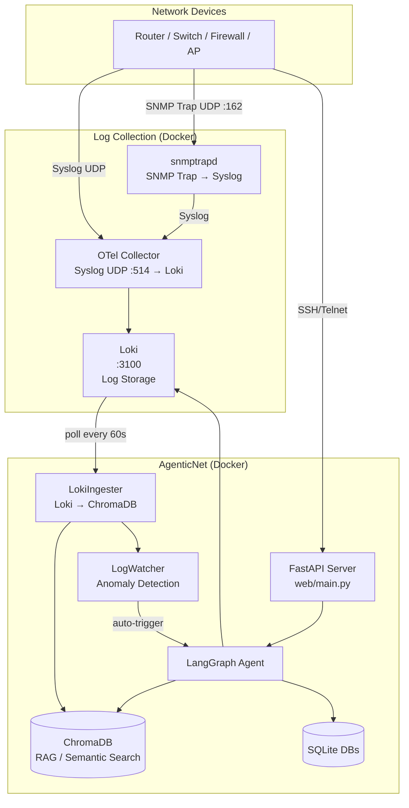
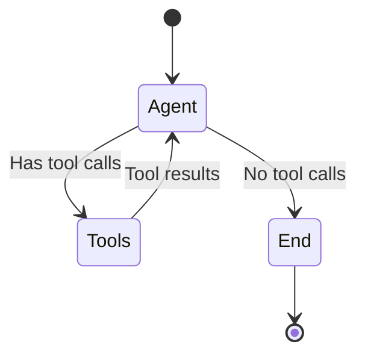
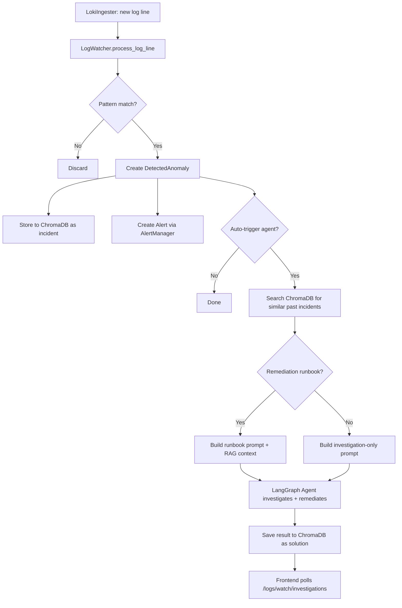
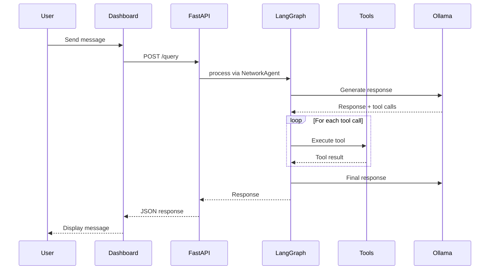
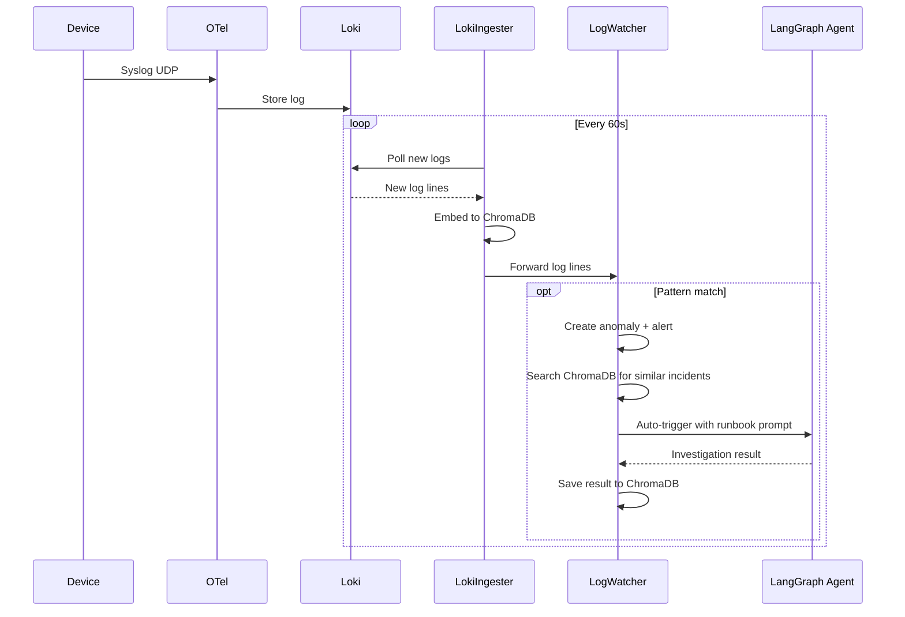
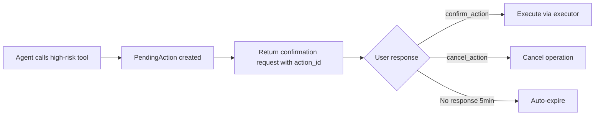

# AgenticNet - Dokumentasi Sistem Lengkap

## Ringkasan Eksekutif

**AgenticNet** adalah sistem AI otonom untuk operasi infrastruktur jaringan yang menggunakan **LangGraph** dengan **Ollama** (LLaMA 3.x / GLM). Sistem ini mengelola, memonitor, dan mengotomasi tugas-tugas jaringan secara cerdas dengan tetap menjaga keamanan dan transparansi.

Arsitektur terkini mengintegrasikan **log pipeline observability** berbasis OpenTelemetry: log dari perangkat jaringan dikirim via Syslog → OTel Collector → **Loki**, kemudian diingest ke **ChromaDB** oleh `LokiIngester`, dan dianalisis oleh `LogWatcher` untuk deteksi anomali dan remediasi otomatis.

---

## Arsitektur Sistem


```mermaid
graph TB
    subgraph "Network Devices"
        DEV[Router / Switch / Firewall / AP]
    end

    subgraph "Log Collection (Docker)"
        SNMPTRAP[snmptrapd\nSNMP Trap → Syslog]
        OTEL[OTel Collector\nSyslog UDP :514 → Loki]
        LOKI[Loki\n:3100\nLog Storage]
    end

    subgraph "AgenticNet (Docker)"
        FASTAPI[FastAPI Server\nweb/main.py]
        LANGGRAPH[LangGraph Agent]
        LOGWATCH[LogWatcher\nAnomaly Detection]
        LOKIINGEST[LokiIngester\nLoki → ChromaDB]
        CHROMA[(ChromaDB\nRAG / Semantic Search)]
        SQLITE[(SQLite DBs)]
    end

    DEV -->|Syslog UDP| OTEL
    DEV -->|SNMP Trap UDP :162| SNMPTRAP
    SNMPTRAP -->|Syslog| OTEL
    OTEL --> LOKI
    LOKI -->|poll every 60s| LOKIINGEST
    LOKIINGEST --> CHROMA
    LOKIINGEST --> LOGWATCH
    LOGWATCH -->|auto-trigger| LANGGRAPH
    FASTAPI --> LANGGRAPH
    LANGGRAPH --> LOKI
    LANGGRAPH --> CHROMA
    LANGGRAPH --> SQLITE
    DEV -->|SSH/Telnet| FASTAPI
```

---

## Struktur Direktori

```
agenticNet/
├── main.py                        # Entry point aplikasi
├── config.py                      # Konfigurasi global
├── requirements.txt               # Dependencies
├── .env / .env.example            # Environment variables
├── Dockerfile                     # Container image AgenticNet
├── docker-compose.yml             # Orkestrasi: Loki + OTel + snmptrapd + AgenticNet
├── loki-config.yaml               # Konfigurasi Loki
├── otel-config.yaml               # Konfigurasi OpenTelemetry Collector
│
├── snmptrapd/                     # SNMP Trap Receiver
│   └── Dockerfile                 # snmptrapd → forward ke OTel sebagai Syslog
│
├── agent/                         # Core AI Agent
│   ├── langgraph_agent.py         # LangGraph agent utama (NetworkAgent)
│   ├── langchain_llm.py           # Multi-LLM wrapper (Ollama + DeepSeek fallback)
│   ├── langgraph_memory.py        # LangGraph MemorySaver checkpointer
│   ├── langchain_tools.py         # Aggregate semua tools untuk agent
│   ├── langchain_device_tools.py  # Device management tools
│   ├── langchain_backup_tools.py  # Config backup tools
│   ├── langchain_memory_tools.py  # Memory management tools
│   ├── langchain_rag_tools.py     # RAG / knowledge search tools
│   ├── langchain_report_tools.py  # Report generation tools
│   ├── langchain_scheduler_tools.py # Scheduler & alert tools
│   ├── langchain_topology_tools.py  # Network topology tools
│   ├── langchain_loki_tools.py    # [NEW] query_loki, get_loki_status tools
│   ├── langchain_logwatch_tools.py  # [NEW] log watch control tools
│   ├── langchain_intelligence_tools.py # [NEW] Network intelligence (baseline, history)
│   ├── langchain_remediation_tools.py  # [NEW] Autonomous remediation tools
│   ├── log_watcher.py             # [NEW] Anomaly detection + auto-remediation
│   ├── loki_ingester.py           # [NEW] Background Loki → ChromaDB pipeline
│   ├── infrastructure.py          # Infrastructure device manager (SQLite)
│   ├── alerting.py                # Alert manager & multi-channel notifications
│   ├── scheduler.py               # Scheduled task execution
│   ├── long_term_memory.py        # Long-term memory + baselines + device history
│   ├── network_topology.py        # Network topology mapping
│   ├── rag_knowledge.py           # RAG knowledge base (ChromaDB)
│   ├── report_generator.py        # Laporan otomatis
│   ├── config_backup.py           # Config backup manager
│   └── logging_config.py          # Structured logging
│
├── modules/                       # Modul Fungsional
│   ├── monitoring.py              # System & network monitoring (psutil)
│   ├── inventory.py               # Device inventory management
│   ├── security.py                # Security & compliance
│   └── guardrails.py              # Risk assessment & approval workflow
│
├── tools/                         # Network Tools
│   ├── network_tools.py           # Diagnostic tools (ping, traceroute, etc)
│   ├── pending_actions.py         # High-risk action confirmation store
│   ├── vendor_drivers.py          # Multi-vendor device drivers
│   └── unified_commands.py        # Cross-vendor command abstraction
│
├── web/                           # Web Interface
│   ├── main.py                    # FastAPI application
│   ├── websocket_manager.py       # WebSocket connection manager
│   ├── routes/                    # Modular route handlers
│   │   ├── health.py              # Health, metrics, network endpoints
│   │   ├── chat.py                # Chat, streaming, conversation endpoints
│   │   ├── models.py              # LLM model management
│   │   ├── workflows.py           # Tool execution & workflows
│   │   ├── infrastructure.py      # Infrastructure & alert management
│   │   ├── devices.py             # Device commands & inventory
│   │   ├── guardrails.py          # Human-in-the-loop approval
│   │   ├── logs.py                # [NEW] App logs + Loki query + ingest pipeline
│   │   └── log_watch.py           # [NEW] Log watch API (anomalies, investigations)
│   ├── templates/                 # Jinja2 templates
│   └── static/                    # CSS, JS, assets
│
└── data/                          # Persistent Data
    ├── conversations.db           # LangGraph conversation checkpoints
    ├── chat_history.db            # Chat history (SQLite)
    ├── long_term_memory.db        # Solutions, baselines & device event history
    ├── devices.db                 # Device registry (SQLite persisted)
    ├── inventory.db               # Device inventory
    ├── metrics.db                 # System metrics history
    ├── config_backups.db          # Configuration backups
    ├── reports/                   # Generated reports
    └── chroma_db/                 # Vector embeddings (RAG)
```

---

## Deployment (Docker)

Cara paling mudah menjalankan sistem lengkap adalah dengan Docker Compose. Semua service (Loki, OTel Collector, SNMP trap receiver, AgenticNet) berjalan dalam satu network `monitoring`.

### 1. Setup Environment

```bash
cp .env.example .env
# Edit .env sesuai kebutuhan
```

### 2. Jalankan dengan Docker Compose

```bash
docker compose up -d
```

Service yang berjalan:

| Service | Port | Fungsi |
|---------|------|--------|
| `agenticnet` | `8000` | Web dashboard & API |
| `loki` | `3100` | Log storage (Grafana Loki) |
| `otel-collector` | `514/udp`, `4317`, `4318` | Syslog collector + OTLP |
| `snmptrapd` | `162/udp` | SNMP Trap → forward ke OTel |

Data (SQLite + ChromaDB) disimpan di `./data/` dan di-mount ke container sehingga persisten.

**Buka browser:** `http://localhost:8000`

### 3. Jalankan Tanpa Docker (development)

```bash
# Install dependencies
python -m venv venv
venv\Scripts\activate  # Windows
pip install -r requirements.txt

# Jalankan server
python main.py
```

> Tanpa Docker, log pipeline (Loki/OTel) tidak tersedia. Agent tetap berfungsi penuh namun `query_loki` dan `LogWatcher` akan merespons dengan pesan "Loki tidak tersedia".

---

## Komponen Utama

### 1. LangGraph Agent

#### langgraph_agent.py

Implementasi agent berbasis LangGraph dengan:

```python
class AgentState:
    messages: Annotated[List[BaseMessage], add_messages]
```

**NetworkAgent Methods:**
- `invoke(query, thread_id)` — Proses query synchronous
- `ainvoke(query, thread_id)` — Proses query async
- `astream(query, thread_id)` — Stream response chunks
- `get_history(thread_id)` — Ambil conversation history
- `clear_history(thread_id)` — Hapus history


```mermaid
stateDiagram-v2
    [*] --> Agent
    Agent --> Tools: Has tool calls
    Agent --> End: No tool calls
    Tools --> Agent: Tool results
    End --> [*]
```

#### langchain_llm.py — Multi-LLM Provider

Mendukung multiple LLM dengan **automatic fallback**:

```python
def get_llm(model=None, base_url=None, temperature=0.7, timeout=45):
    """Tries Ollama first, falls back to DeepSeek if configured."""
```

**Provider yang didukung:**
- **Ollama** (primary) — lokal, gratis, privacy-first
- **DeepSeek** (fallback) — via OpenAI-compatible API jika `DEEPSEEK_API_KEY` di-set

---

### 2. Log Pipeline (Observability)

Pipeline utama untuk monitoring log perangkat jaringan:

```
Network Device
    │
    ├── Syslog UDP :514 ──────────────► OTel Collector
    │                                        │
    └── SNMP Trap UDP :162 ──► snmptrapd ──►┘
                                             │
                                        Loki :3100
                                             │
                                       LokiIngester (poll 60s)
                                        ├── ChromaDB (embed)
                                        └── LogWatcher (anomaly)
                                                │
                                          LangGraph Agent
                                         (auto-investigate)
```

#### loki_ingester.py

Background service (`LokiIngester`) yang berjalan di dalam AgenticNet:
- Poll Loki setiap 60 detik untuk log baru
- Embed log lines ke **ChromaDB** untuk semantic search
- Forward log lines ke **LogWatcher** untuk anomaly detection

```python
class LokiIngester:
    async def start(interval_seconds=60)
    async def stop()
    def get_status() -> dict
```

#### log_watcher.py

Service deteksi anomali dan remediasi otomatis (`LogWatcher`):

**Anomaly Patterns bawaan:**

| Pattern | Severity | Contoh |
|---------|----------|--------|
| `link_down` | critical | Interface changed state to down |
| `link_flap` | warning | Interface flapping detected |
| `auth_failure` | critical | LOGIN FAILED, authentication denied |
| `system_error` | critical | kernel panic, out of memory |
| `system_warning` | warning | high CPU, disk full |
| `routing_change` | warning | OSPF neighbor down, BGP reset |
| `stp_change` | warning | Spanning tree topology change |
| `hardware_issue` | critical | fan fail, temperature alarm |

**Alur Remediasi Otomatis:**


```mermaid
flowchart TD
    A[LokiIngester: new log line] --> B[LogWatcher.process_log_line]
    B --> C{Pattern match?}
    C -->|No| D[Discard]
    C -->|Yes| E[Create DetectedAnomaly]
    E --> F[Store to ChromaDB as incident]
    E --> G[Create Alert via AlertManager]
    E --> H{Auto-trigger agent?}
    H -->|No| I[Done]
    H -->|Yes| J[Search ChromaDB for similar past incidents]
    J --> K{Remediation runbook?}
    K -->|Yes| L[Build runbook prompt + RAG context]
    K -->|No| M[Build investigation-only prompt]
    L --> N[LangGraph Agent investigates + remediates]
    M --> N
    N --> O[Save result to ChromaDB as solution]
    O --> P[Frontend polls /logs/watch/investigations]
```

**Remediation Runbooks** tersedia untuk: `link_down`, `link_flap`, `auth_failure`, `system_error`, `system_warning`, `routing_change`, `hardware_issue`.

---

### 3. Tool System

#### Kategori Tools Agent

| Kategori | Tools Utama | File |
|----------|-------------|------|
| **Connectivity** | `ping`, `traceroute`, `check_port`, `port_scan` | `langchain_tools.py` |
| **DNS** | `dns_lookup`, `nslookup` | `langchain_tools.py` |
| **Info** | `get_network_info`, `get_provider_info`, `get_interfaces` | `langchain_tools.py` |
| **Monitoring** | `get_connections`, `measure_latency`, `get_bandwidth_stats` | `langchain_tools.py` |
| **High-Risk** | `disable_local_interface`, `enable_local_interface`, `shutdown_remote_interface`, `enable_remote_interface` | `langchain_tools.py` |
| **Confirmation** | `confirm_action`, `cancel_action` | `langchain_tools.py` |
| **Device** | `get_device_info`, `get_cpu_memory`, `get_routing_table` | `langchain_device_tools.py` |
| **RAG** | `search_knowledge`, `add_knowledge` | `langchain_rag_tools.py` |
| **Scheduler** | `create_schedule`, `list_schedules`, `cancel_schedule` | `langchain_scheduler_tools.py` |
| **Backup** | `backup_config`, `restore_config`, `list_backups` | `langchain_backup_tools.py` |
| **Topology** | `get_topology`, `discover_neighbors` | `langchain_topology_tools.py` |
| **Reports** | `generate_report`, `list_reports` | `langchain_report_tools.py` |
| **Loki** | `query_loki`, `get_loki_status` | `langchain_loki_tools.py` |
| **Intelligence** | `save_diagnostic_result`, `query_device_history`, `get_network_baseline`, `check_anomaly_against_baseline` | `langchain_intelligence_tools.py` |
| **Remediation** | (internal runbook tools) | `langchain_remediation_tools.py` |

#### query_loki (langchain_loki_tools.py)

Memungkinkan agent query log langsung ke Loki via **LogQL**:

```python
@tool
def query_loki(logql: str, since_minutes: int = 10, limit: int = 100) -> str:
    """
    Contoh logql:
    '{job="syslog"}' — semua log
    '{job="syslog"} |= "error"' — filter error
    '{job="syslog", "host.name"="router1"}' — device tertentu
    '{job="syslog"} |~ "BGP|OSPF"' — routing events
    """
```

#### Network Intelligence Tools (langchain_intelligence_tools.py)

Tools untuk membangun **network memory** yang adaptif:

| Tool | Fungsi |
|------|--------|
| `save_diagnostic_result` | Simpan hasil investigasi ke device event history |
| `query_device_history` | Lihat riwayat event/masalah per device |
| `get_network_baseline` | Lihat baseline "normal" per device/metrik |
| `check_anomaly_against_baseline` | Cek & update baseline metrik device |

---

### 4. Memory System

#### LangGraph Memory (langgraph_memory.py)

Conversation persistence berbasis LangGraph `MemorySaver`:
- Thread-based isolation per percakapan
- Database: `data/conversations.db`

#### Long-Term Memory (long_term_memory.py)

Menyimpan solusi troubleshooting, device event history, dan baseline metrik:

```python
class LongTermMemory:
    # Solutions & patterns
    def save_solution(problem, solution, category, metadata)
    def find_similar_solutions(query, category, limit)
    
    # Device event history (NEW)
    def record_event(device_ip, event_type, event_data, severity, source) -> int
    def get_device_history(device_ip, event_type, limit) -> list
    
    # Baseline learning (NEW)
    def update_baseline(device_ip, metric, value)
    def get_baseline(device_ip, metric) -> dict
    def is_anomalous(device_ip, metric, value) -> dict
```

**Database**: `data/long_term_memory.db`
- Tabel `solutions`: Cached troubleshooting solutions
- Tabel `preferences`: User preferences
- Tabel `patterns`: Learned patterns
- Tabel `device_events`: Network device event history
- Tabel `baselines`: Per-device metric baselines (auto-learned)

---

### 5. Infrastructure & Alert System

#### Infrastructure Manager (agent/infrastructure.py)

Manajemen perangkat jaringan dengan SQLite persistence (`data/devices.db`):

```python
class InfrastructureManager:
    def add_device(name, ip, device_type, ...) -> NetworkDevice
    def remove_device(device_id) -> bool
    def get_device(device_id) -> NetworkDevice
    def list_devices(device_type, status) -> List
    def update_device(device_id, **kwargs) -> NetworkDevice
    def get_status_summary() -> Dict
    def export_config() -> str
    def import_config(config_json) -> int
```

**Device Types:** `router`, `switch`, `server`, `pc`, `printer`, `access_point`, `firewall`, `other`

**Connection Protocol:** `ssh`, `telnet`, `none`

#### Terminal Panel (SSH/Telnet)

| Endpoint | Fungsi |
|----------|--------|
| `POST /infra/devices/{id}/ssh/exec` | Eksekusi command via SSH |
| `POST /infra/devices/{id}/telnet/exec` | Eksekusi command via Telnet |
| `POST /infra/devices/{id}/remote/exec` | Unified — otomatis pilih SSH/Telnet |

#### Alert Manager (agent/alerting.py)

**Alert Channels:** Dashboard (WebSocket), Webhook, Discord, Telegram, Email

**Alert Severity:** `info`, `warning`, `critical`

---

### 6. Web Layer

#### FastAPI Application (web/main.py)

```python
app.include_router(health_routes.router)
app.include_router(chat_routes.router)
app.include_router(model_routes.router)
app.include_router(workflow_routes.router)
app.include_router(infra_routes.router)
app.include_router(device_routes.router)
app.include_router(guardrails_routes.router)
app.include_router(logs_routes.router)      # NEW
app.include_router(log_watch_routes.router) # NEW
```

#### Endpoints Overview

| Category | Endpoint | Method | Description |
|----------|----------|--------|-------------|
| **Core** | `/` | GET | Dashboard |
| **Health** | `/health` | GET | Health check |
| | `/monitoring/metrics` | GET | System metrics |
| **Network** | `/network/interfaces` | GET | Network interfaces |
| | `/network/latency` | GET | Latency measurement |
| **Security** | `/security/status` | GET | Security findings |
| **Chat** | `/query` | POST | Query agent |
| | `/stream` | WS | Stream agent response |
| | `/ws/metrics` | WS | Real-time metrics |
| | `/conversation/{thread_id}` | GET | Get history |
| **Model** | `/agent/models/list` | GET | List models |
| | `/agent/model/switch` | POST | Switch model |
| **Tools** | `/tools/run` | POST | Run network tool |
| | `/tools/pending` | GET | List pending actions |
| | `/tools/confirm/{id}` | POST | Confirm action |
| | `/tools/cancel/{id}` | POST | Cancel action |
| **Infrastructure** | `/infra/devices` | GET/POST | Device management |
| | `/infra/devices/{id}` | GET/PUT/DELETE | Single device |
| | `/infra/devices/{id}/status` | GET | Check device status |
| | `/infra/devices/{id}/remote/exec` | POST | Remote command exec |
| | `/infra/monitor/start` | POST | Start monitoring |
| | `/infra/alerts` | GET | Active alerts |
| | `/infra/live` | WS | Live infrastructure |
| **Device** | `/device/{ip}/interfaces` | GET | Device interfaces |
| | `/device/{ip}/logs` | GET | Device logs |
| **Guardrails** | `/guardrails/plan` | POST | Create action plan |
| | `/guardrails/approve/{id}` | POST | Approve plan |
| **App Logs** | `/logs/app` | GET | Application log entries |
| | `/logs/app/stream` | GET (SSE) | Real-time log tail |
| **Loki Logs** | `/logs/loki` | GET | Query Loki via LogQL |
| | `/logs/loki/recent` | GET | Recent device logs |
| | `/logs/loki/hosts` | GET | List devices in Loki |
| | `/logs/loki/ingest/start` | POST | Start Loki→ChromaDB pipeline |
| | `/logs/loki/ingest/stop` | POST | Stop ingestion pipeline |
| | `/logs/loki/ingest/status` | GET | Ingestion pipeline status |
| **Log Watch** | `/logs/watch/start` | POST | Start log watching |
| | `/logs/watch/stop` | POST | Stop log watching |
| | `/logs/watch/status` | GET | Log watcher status |
| | `/logs/anomalies` | GET | Detected anomalies |
| | `/logs/watch/investigations` | GET | Auto-triggered investigations |
| | `/logs/patterns` | GET/POST | Anomaly patterns |

---

## Alur Kerja (Workflow)

### 1. Chat Query Flow


```mermaid
sequenceDiagram
    participant User
    participant Dashboard
    participant FastAPI
    participant LangGraph
    participant Tools
    participant Ollama

    User->>Dashboard: Send message
    Dashboard->>FastAPI: POST /query
    FastAPI->>LangGraph: process via NetworkAgent
    LangGraph->>Ollama: Generate response
    Ollama-->>LangGraph: Response + tool calls
    
    loop For each tool call
        LangGraph->>Tools: Execute tool
        Tools-->>LangGraph: Tool result
    end
    
    LangGraph->>Ollama: Final response
    LangGraph-->>FastAPI: Response
    FastAPI-->>Dashboard: JSON response
    Dashboard-->>User: Display message
```

### 2. Log Pipeline & Auto-Remediation Flow


```mermaid
sequenceDiagram
    participant Device
    participant OTel
    participant Loki
    participant Ingester as LokiIngester
    participant Watcher as LogWatcher
    participant Agent as LangGraph Agent

    Device->>OTel: Syslog UDP
    OTel->>Loki: Store log
    
    loop Every 60s
        Ingester->>Loki: Poll new logs
        Loki-->>Ingester: New log lines
        Ingester->>Ingester: Embed to ChromaDB
        Ingester->>Watcher: Forward log lines
        
        opt Pattern match
            Watcher->>Watcher: Create anomaly + alert
            Watcher->>Watcher: Search ChromaDB for similar incidents
            Watcher->>Agent: Auto-trigger with runbook prompt
            Agent-->>Watcher: Investigation result
            Watcher->>Watcher: Save result to ChromaDB
        end
    end
```

### 3. High-Risk Action Flow


```mermaid
flowchart LR
    A[Agent calls high-risk tool] --> B[PendingAction created]
    B --> C[Return confirmation request with action_id]
    C --> D{User response}
    D -->|confirm_action| E[Execute via executor]
    D -->|cancel_action| F[Cancel operation]
    D -->|No response 5min| G[Auto-expire]
```

---

## Keamanan & Guardrails

### Risk Assessment

| Level | Contoh | Behavior |
|-------|--------|----------|
| `INFO` | show commands | Auto-execute |
| `LOW` | config read | Auto-execute |
| `MEDIUM` | add/modify config | Request approval |
| `HIGH` | shutdown interface | Create PendingAction |
| `CRITICAL` | reload, format, erase | Create PendingAction |

### Blocked Commands

Command yang **selalu diblokir**: `format flash`, `erase nvram`, `delete running-config`

### Iteration Limits

- Max iterasi per sesi: 5 (dikonfigurasi di agent)
- Mencegah infinite tool loops

---

## Konfigurasi Environment

### Required Variables

```bash
OLLAMA_HOST=http://localhost:11434
OLLAMA_MODEL=gpt-oss:20b
HOST=0.0.0.0
PORT=8000
DEBUG=false

# Device credentials
DEVICE_USERNAME=admin
DEVICE_PASSWORD=secret
DEVICE_ENABLE=enable_secret
```

### Optional Variables

```bash
# Loki (otomatis diisi docker-compose, override jika perlu)
LOKI_URL=http://loki:3100

# DeepSeek LLM fallback
DEEPSEEK_API_KEY=your-deepseek-api-key
DEEPSEEK_MODEL=deepseek-coder

# Alert integrations
DISCORD_WEBHOOK_URL=https://discord.com/api/webhooks/...
TELEGRAM_BOT_TOKEN=your-bot-token
TELEGRAM_CHAT_ID=your-chat-id

# NetBox integration
NETBOX_URL=https://netbox.example.com
NETBOX_TOKEN=your-api-token
```

---

## Kompatibilitas Vendor

| Device | SNMP | Syslog | REST API | SSH | Telnet |
|--------|:----:|:------:|:--------:|:---:|:------:|
| Cisco IOS-XR/XE | ✅ | ✅ | ✅ | ✅ | ✅ |
| Juniper | ✅ | ✅ | ✅ | ✅ | ✅ |
| MikroTik | ✅ | ✅ | ✅ | ✅ | ❌ |
| UniFi (Ubiquiti) | ✅ | ✅ | ✅* | ✅ | ❌ |
| Ruijie Enterprise | ✅ | ✅ | ❌ | ✅ | ✅ |
| Reyee | ✅ | ✅ | ⚠️ | ✅ | ✅ |
| Linux Server | ✅ | ✅ | - | ✅ | - |

*UniFi Controller API (unofficial tapi stabil)*

---

## Dependencies

### Core
- `fastapi`, `uvicorn` — Web framework
- `langchain`, `langchain-ollama` — LLM framework
- `langgraph` — Agent graph orchestration
- `pydantic` — Data validation

### Monitoring & Tools
- `psutil` — System monitoring
- `httpx` — Async HTTP client (Loki, alerts)
- `python-dotenv` — Environment management
- `jinja2` — HTML templating
- `websockets` — WebSocket support

### Network Drivers
- `netmiko` — Network device SSH
- `paramiko` — SSH library
- `textfsm`, `ntc-templates` — CLI output parsing

### Optional
- `chromadb` — Vector database for RAG
- `pynetbox` — NetBox API integration
- `openai` — DeepSeek LLM fallback
- `aiohttp` — Async HTTP (Discord/Telegram alerts)
- `aiosqlite` — Async SQLite

---

## Pengembangan & Debugging

### Menambah Anomaly Pattern Baru

Di `agent/log_watcher.py`, tambahkan ke `DEFAULT_PATTERNS`:
```python
AnomalyPattern(
    name="bgp_down",
    pattern=r"BGP.*neighbor.*down",
    severity="critical",
    description="BGP neighbor went down"
)
```

Tambahkan runbook di `REMEDIATION_RUNBOOKS` jika ingin auto-remediasi.

### Menambah Tool Agent Baru

1. Buat `@tool` di file yang sesuai (atau buat file baru `langchain_xyz_tools.py`)
2. Tambahkan ke `get_all_tools()` di `agent/langchain_tools.py`

### Logging

```python
from agent.logging_config import get_logger
logger = get_logger("module_name")
logger.info("Message")
logger.error("Error occurred", exc_info=True)
```

---

## Troubleshooting

### Loki tidak tersedia

```
⚠️ Tidak bisa connect ke Loki (http://loki:3100)
```
**Solusi**: Jalankan dengan `docker compose up -d loki`. Tanpa Docker, log pipeline memang tidak tersedia.

### Ollama Connection Error

```
Error: Could not connect to Ollama
```
**Solusi**: Pastikan Ollama berjalan (`ollama serve`) dan `OLLAMA_HOST` sudah benar di `.env`.

### Model Not Found

```
Error: Model 'xxx' not found
```
**Solusi**: Pull model dengan `ollama pull <model-name>`

### SQLite Threading Issues

```
Error: SQLite objects created in a thread...
```
**Solusi**: Sistem sudah menggunakan `check_same_thread=False`, restart server jika masih terjadi.

### High-Risk Action Expired

```
Action 'xxx' tidak ditemukan atau sudah expired
```
**Solusi**: Pending actions expire setelah 5 menit. Minta agent untuk mencoba lagi.

---

*Dokumentasi ini diperbarui berdasarkan kondisi arsitektur AgenticNet per Maret 2026.*
